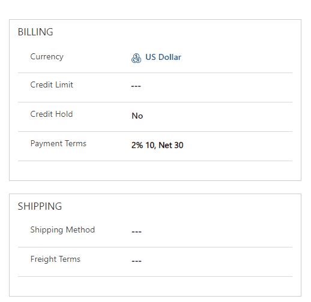

# PCF CSV Dropdown Control

## Overview

CSV Dropdown Controlt allows you to define array of CSV values in the configuration parameters that will be presented in the dropdown menu.

## Download

## Configuration

| Field      | Description                                                  |
| ---------- | ------------------------------------------------------------ |
| CSV Values | Values separated with ";" sign which will be displayed in the dropdown menu. |

## Preview

## Features

- Define CSV values to be displayed in dropdown menu